# Coffe Shop

Coffee Shop App adalah aplikasi pemesanan kopi berbasis web.  
Aplikasi ini memungkinkan user untuk melihat menu, memilih varian, melakukan checkout, melihat histori pesanan.  
Tersedia halaman **admin** untuk mengelola produk, pesanan, dan user.

---

## Fitur Utama

- Register akun
- Login & Forgot Password
- Melihat daftar produk kopi
- Melihat detail produk
- Memilih varian
- Checkout pesanan
- Melihat histori pesanan
- Melihat detail order
- Melihat & mengubah profil

### Admin

- Dashboard admin
- Manajemen produk (lihat & tambah produk)
- Melihat daftar order
- Melihat detail order
- Manajemen user (lihat & tambah user)

---

## Screenshot Aplikasi

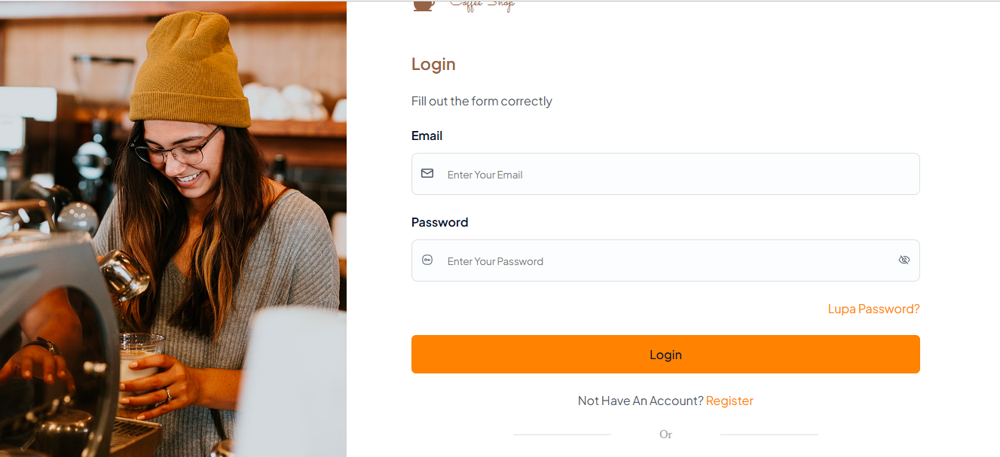
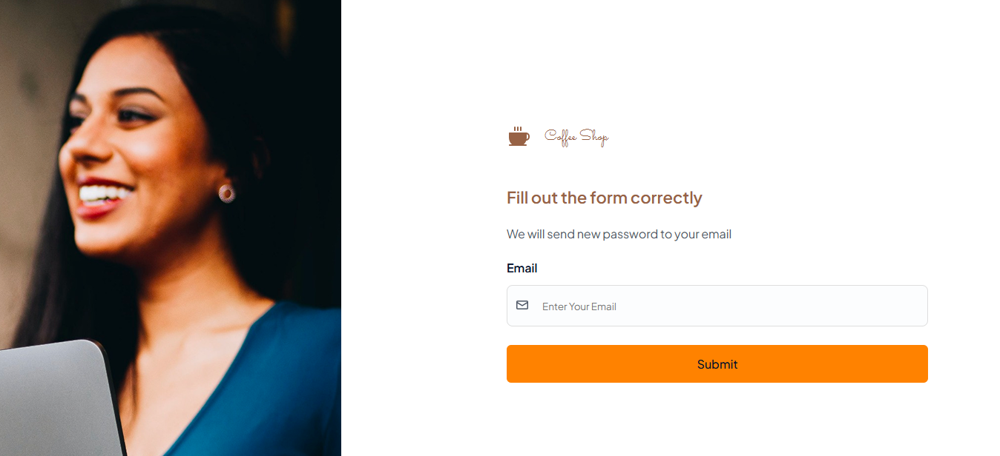
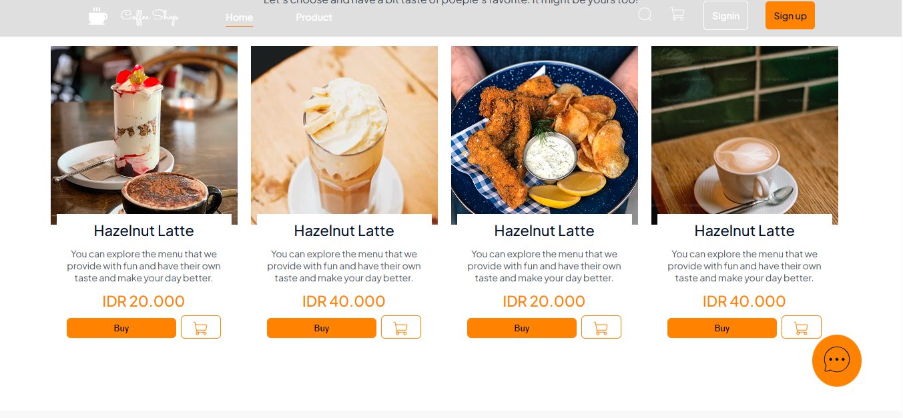
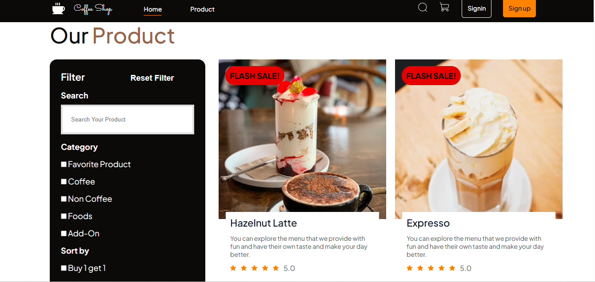
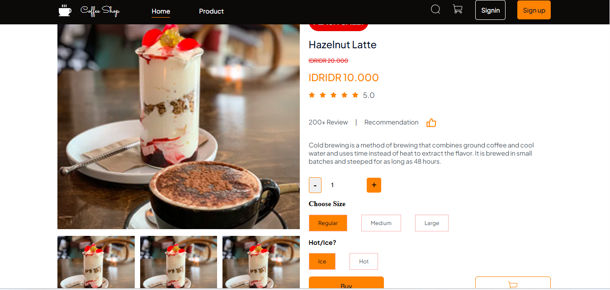
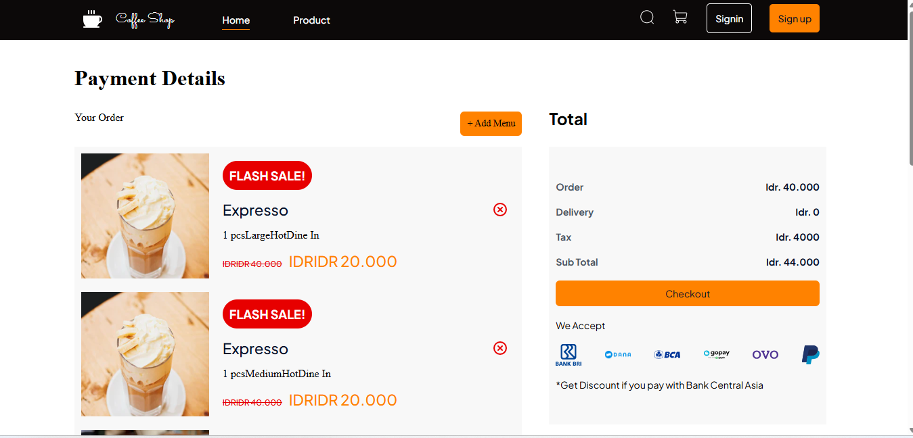
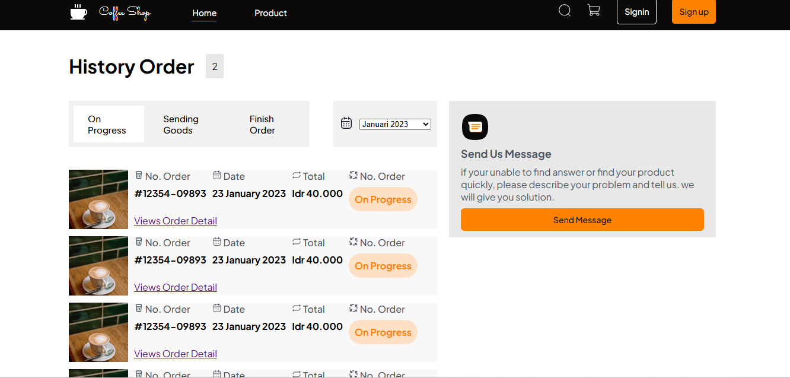
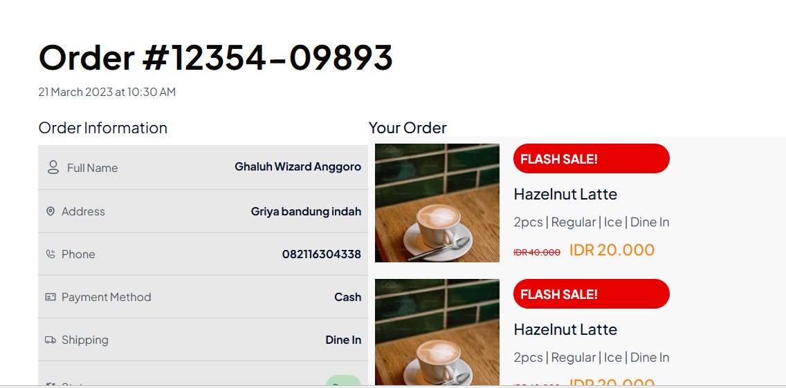
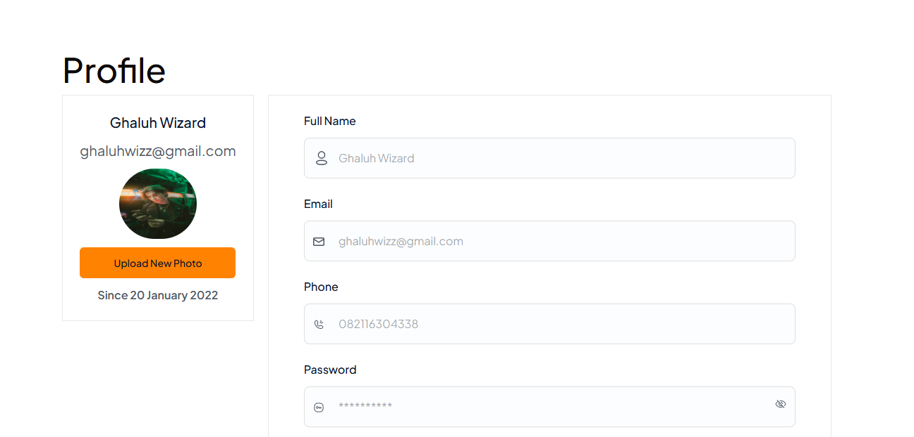

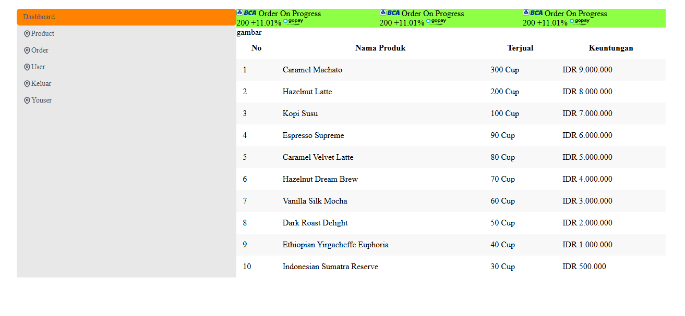
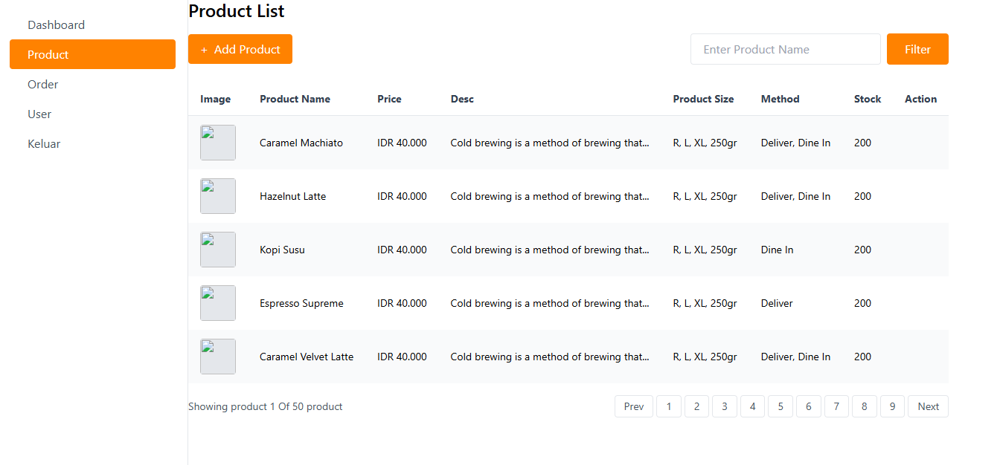
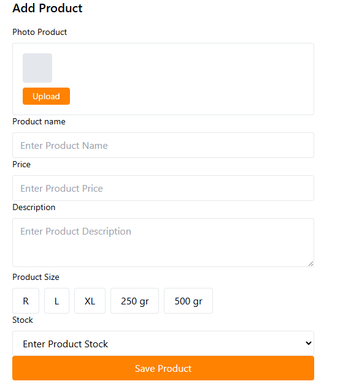
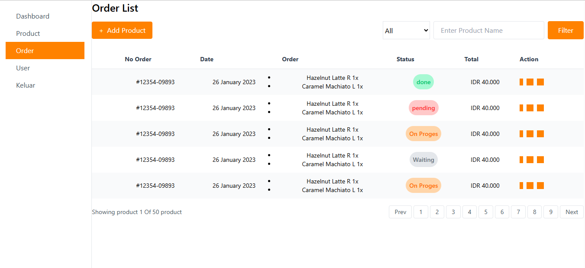
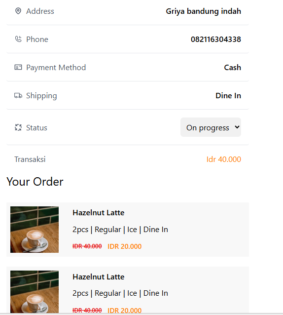
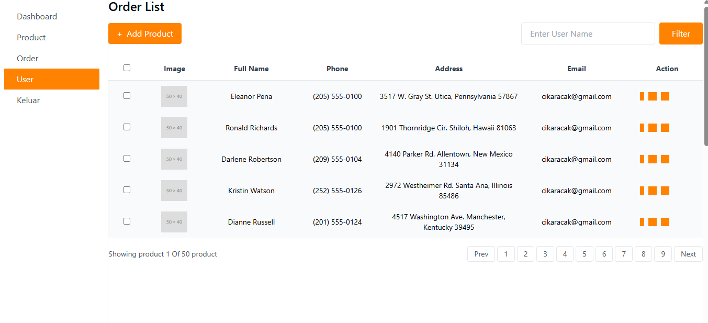
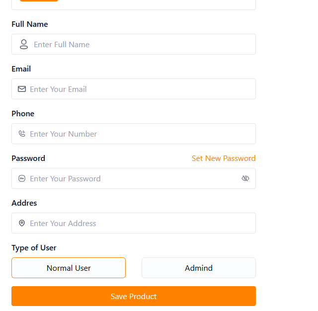

## Teknologi yang Digunakan

- HTML
- CSS / Tailwind CSS
- JavaScript
- jQuery
- LocalStorage

---

## Cara Menjalankan Project

- Clone repository ini

- git clone https://github.com/adityabastyas/koda-b6-html.git
- buka index.html
- jalankan aplikasi
